# Digitalisation of Business Processes - Team Alpabzug
Alfredo Crego, Travis Fears, Frederik Hantke, Xue Wang

## Patient Practice appointment and document request system
A family doctor practice receives many visits, calls and emails a day, requesting several types of services, ranging from setting and cancelling an appointment with the doctor or medical assistent team, renewing medication, laboratory tests and even emergencies. All these requests consume a lot of time from the MPA (Medical Practice Assistant).
Our goal is to implement a digitalized system capable of handeling two of the most comon scenarios freeing the MPAs for performing more valuable tasks in the practice, like caring about the patients in the clinic.

## General as-is analysis
### 1. Participants:
- Patients and family members
- Home nursing services like "Spitex"
- Senior Residence: elderly care
- Specialists
- Laboratories
    - internal
    - external
- Hospitals
- Pharmacies
- Insurances and Governmental (SUVA) payers

### 2. Services:
- Medical consultation
- Medical therapy
- Pharmacy
    - internal: robot dispenser for medication
    - external: medication prescriptions to pharmacies
- Functional diagnostics
    - Electronic cardiography (ECG)
    - Lung testing
      - Spirography
      - Lung function
    - Sleep diagnostics
      - internal
      - external
- Diagnostic imaging
    - internal
      - X-Ray
      - Ultrasound 
    - external
      - CT
      - MIR
      - Scintigraphy

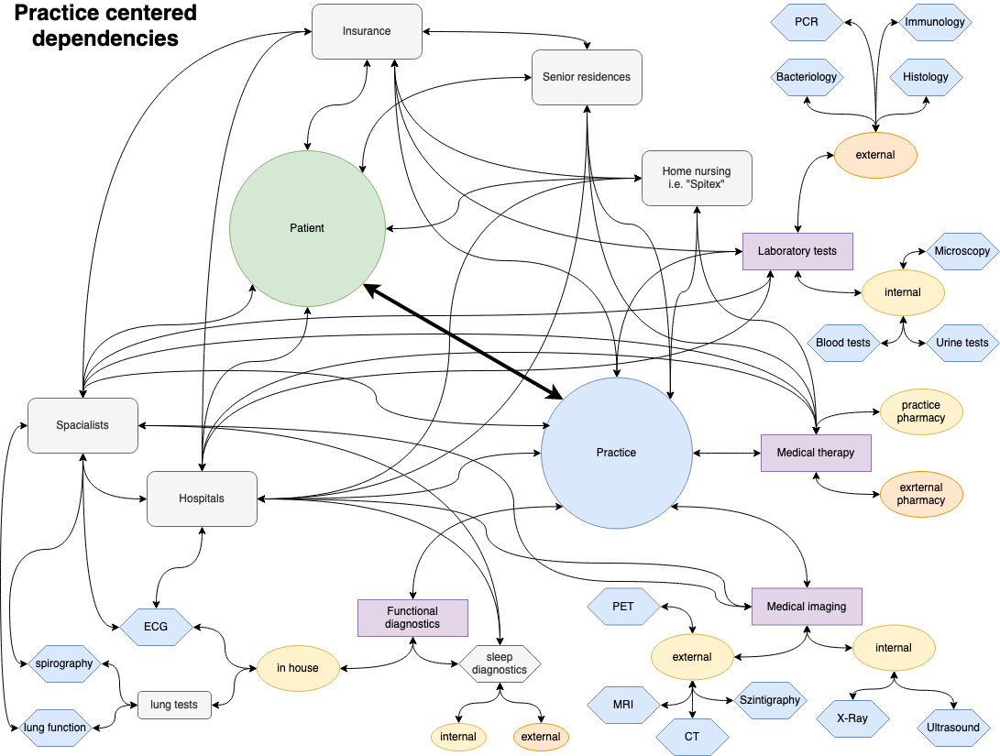

### 3. MPA actions:
- Organize appointments
- Prepare and medication refills
- Prepare and send prescriptions
- Take laboratory testing and preparation for external analysis
- Prepare and send referral to external service
- Prepare and send medical certificates / sick notes
- Correspondence with insurance companies
- Prepare and send medical reports
- Recommend and do functional test on patients

### 4. Communication channels
1. Phone call
2. Email
3. In person in practice
4. Letter
5. (in rare cases) FAX

## DigiBP project related user stories
We picked two of the most common MPA user stories:
### User story #1 - Get an appointment:
#### A) By telephone - a patient is calling the medical practice assistant (MPA):
1. The MPA asks for:
- First name, last name, date of birth
- Appointment for the caller himself or another person (husband, child, parent, partner, ...)
- Reason for the call:
    - **Emergency** *: Patient needs information on what to do, may want to get an appointment at the office as soon as possible, or is being referred directly to the hospital emergency room. In the case of an office visit, he or she will receive a special emergency appointment or be seen concurrently with the standard program.
    - **Urgency** *: Patient is ill, for example, and needs a non-regular appointment, same day or next day (usually with lab; X-ray, EKG, or wound care, as appropriate). Gets a special and possibly shorter time slot.
    - **Standard appointment** *: Non-urgent issues such as skin lesions, follow-up e.g. blood pressure. May be given a time slot of up to 30 minutes in the next 3-7 days (or when patient has time to come in)
    - **Standard appointment** *: In case of external laboratory test the appointments can be split into two different consultations: the first in the morning without breakfast on one day, the second later in the day or several days later just to discuss the results.
    - **Therapy appointment** ** : Appointment without (simultaneous) medical consultation e.g. only for therapies, such as vaccination, infusion or vitamin injections. Appointment is made with the MPA team and is based on available time slots (no emergencies).
    - **reordering of medicines** **: Name and number of needed medicaments
    - **General health advice**: *: Request for vaccination, demand for services in the practice.

        (*) Appointment types are available for new or known patients.

        (**) appointment types for known patients only

2. The MPA checks the available time slots in the doctors' appointment calendar (a patient has one principal doctor, only in case of emergency the doctors can be changed) and the available therapy/laboratory rooms.
3. The MPA informs the patient of the date and time to come to the office.

#### B) By email:
1. The patient visits the practice website and clicks on the "Contact" button to receive a (HTML coded mailto:) link that opens the email program on the visitor's computer to write a message.
2. Or writes directly with his computer, since he already knows the e-mail address of the practice.
3. Writes down the intention of contact (appointment, general information (e.g., open to new patients), request for medication refill)
4. MPA writes or calls (depending on reason) patient and provides requested details (e.g., date, time of appointment offered)
5. Patient agrees and writes a confirmation email
6. Sometimes the patient does not confirm the appointment and does not show up for the scheduled appointment.

#### C) by coming in person into the practice:
1. The patient (or a person responsible for him/her) comes to the practice in person.
2. MPA speaks with the person and clarifies the reason for the visit (appointment (emergency or later), general question, or medication order/pickup)
3. MPA completes the requested task
4. Patient leaves the office to come to the scheduled appointment
5. Or gets an immediate appointment because of an emergency

### User story #2 - Get a spitex referral (document)
#### A) By telephone - a patient is calling the medical practice assistant (MPA):
1. the MPA asks for:
- First name, last name, date of birth
- Receiver details of the referral (i.e. Name and address)
2. the MPA prepares the referral as a text document, prints it and gives it to the principal doctor of the patient to get it signed.
3. After signing the document gets scanned and send by email or post mail to the final destination

## Summary of the chosen DigiBP project scenario:
- fast and time-independent availability
- low time requirement of the MPA staff
- easy access via online form and telephone

## Chosen system architecture
- Frontend:
    - Google Sites: landing page (https://sites.google.com/view/alpabzug)
    - DialogFlow Chatbot: text based and voice assisted chatbot
    - DialogFlow Telephone (+1 870-399-0388): to talk to the chatbot in case of disabilities 
- Middleware:
    - Make.com (former Integromat): integration of Frontend and Backend services
- Backend:
    - Camunda: DigiBP Team Alpabzug, business process
    - Google Calendar: appointments calendar
    - Google Sheet: loggin of chat events and patient database
    - Google Docs: templates for document preparation
    - Email: secure email service with HIN.ch (on healthcare data privacy level)

Disclamer: For data protection regulation compliance, the patient database should be changed to a more secure one as it contains personal identifiable data. For this prototype we opted for a simple Google sheet for sace of simplicity.

## Medical Doctor Appointment System - MiDAS Process:
1. The patient starts the DialogFlow based chat (text-based or via telephone number +1 870-399-0388) on the [DigiBP MiDAS Homepage](https://sites.google.com/view/alpabzug) and requests for help.

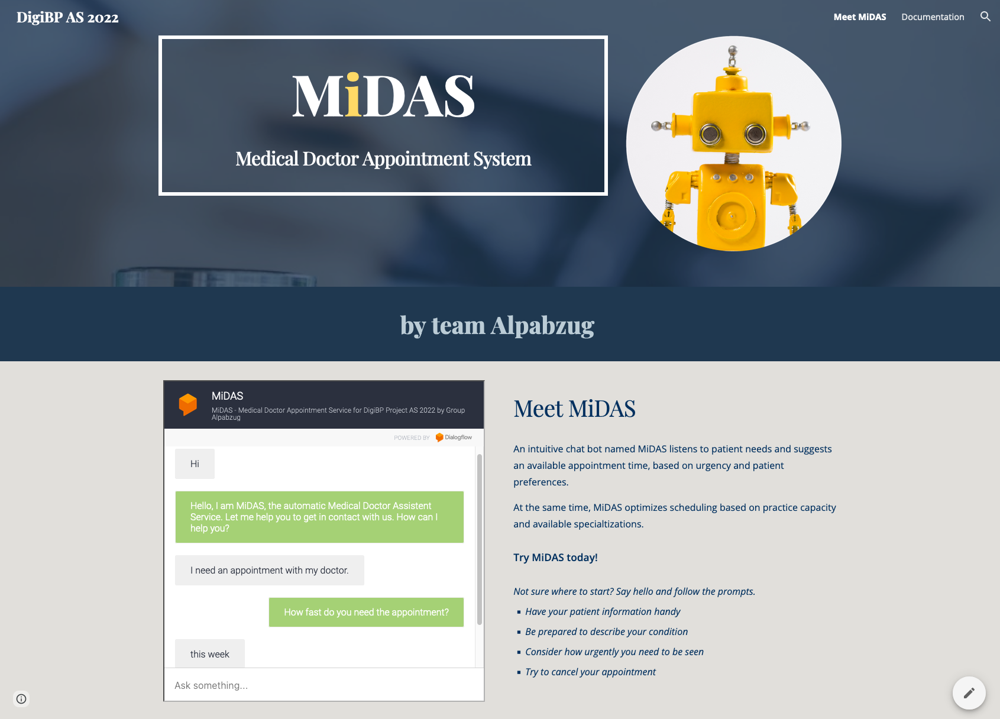

During the conversation, various intents are processed to fetch the desired help on the topics. Depending on the specified keywords, DialogFlow starts dialog routes and asks for more information.

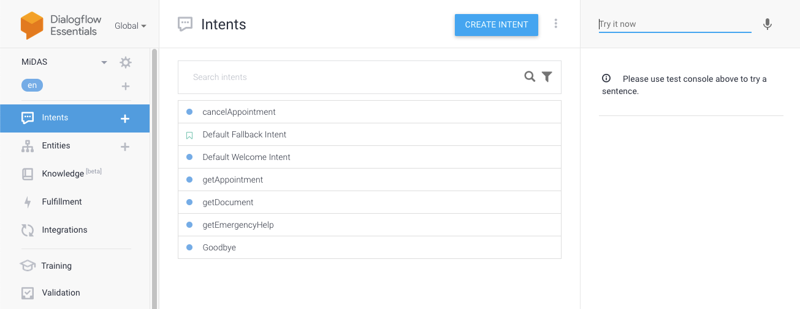

If all for the process required information is gathered from the patient, a MAKE start-scenario is getting triggered:

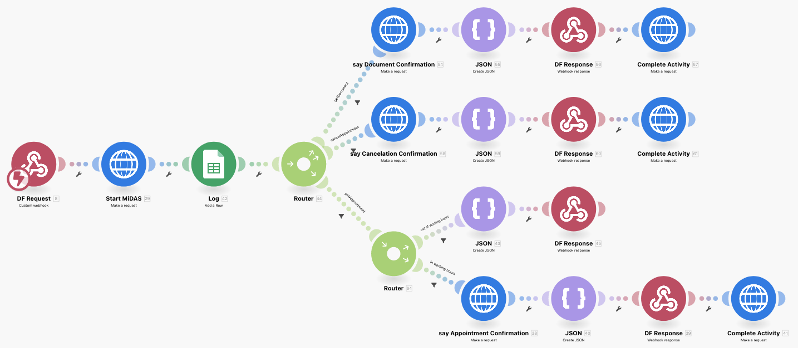

MAKE itself routes the information according to the matched intents into a first HTTP-Request to the BPMN-Onlineservice and stores all of the request details into a [Google spreadsheet](https://docs.google.com/spreadsheets/d/15qfKnef8cB0ITgi7FJ3z1zRYUVWgd-7CKFAEn3LiJ6E/edit?usp=sharing) for logging.

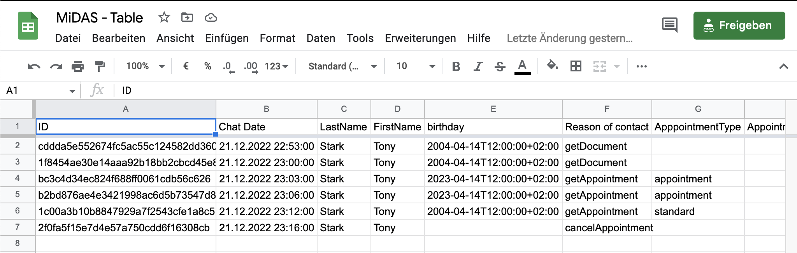

Differend Webhook connections (requestAppointment, identifyPatient, appointmentDate, confirmAppointment, additionalPatientInfo and laterAppointment) of the Camunda BPMN enviroment are the pipeline between the BPMN and DialogFlow.

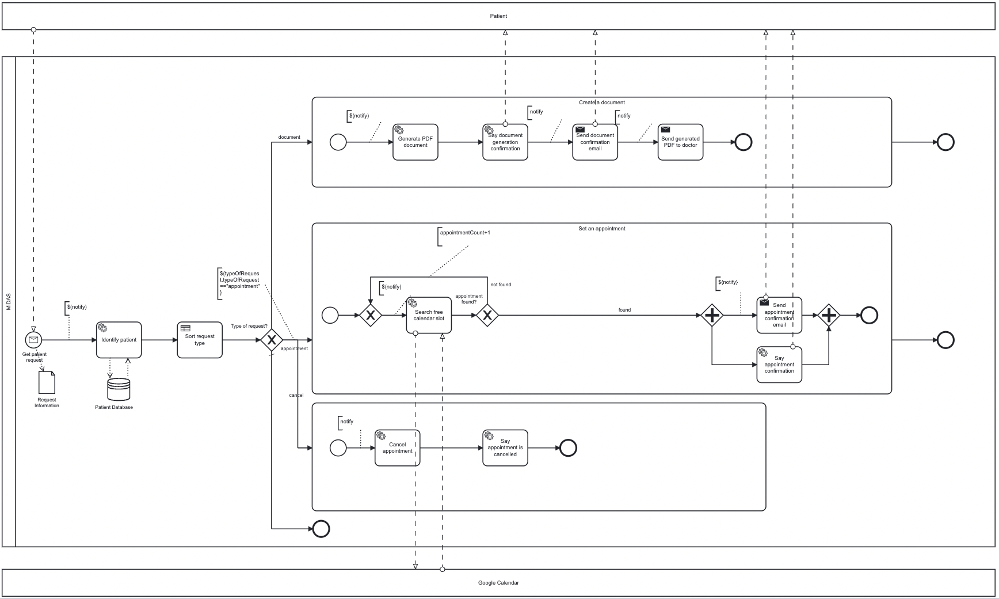

The workflow in Camunda gets all information from MAKE and tries to identify the patient with the database of already known patients. 

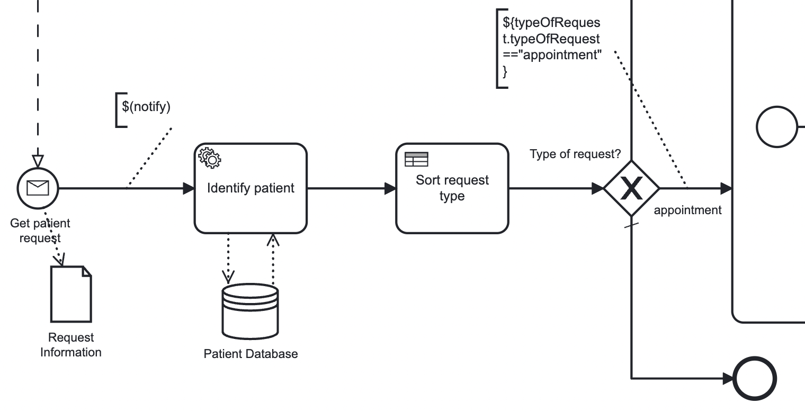

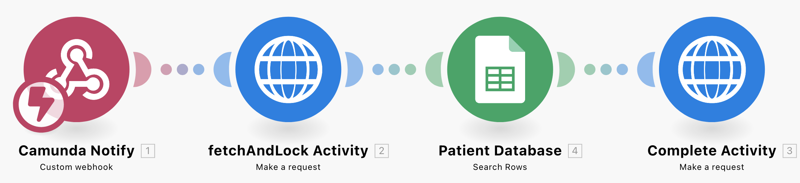

We used for that a [Google Sheet](https://docs.google.com/spreadsheets/d/15qfKnef8cB0ITgi7FJ3z1zRYUVWgd-7CKFAEn3LiJ6E/edit?usp=sharing). If the patient is known, a "known" flag will be set (because for example the document request service is availabe for known patiens only).

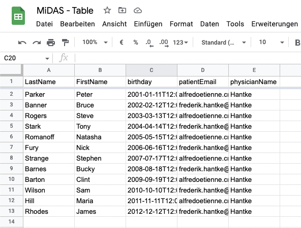

After the identification the request will be processed in a decision table for i.e. pre-defined appointment lenght and calendars or the principal physicians email address:

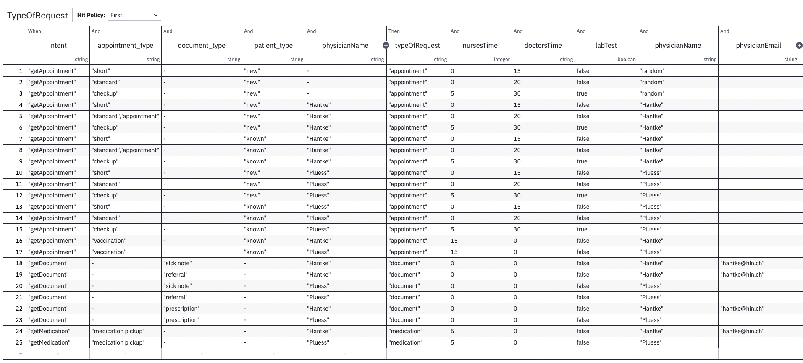

The type of request is getting filtered and a sub process ("Create a document", "Set an appointment" or "Cancel an appointment") will be started:

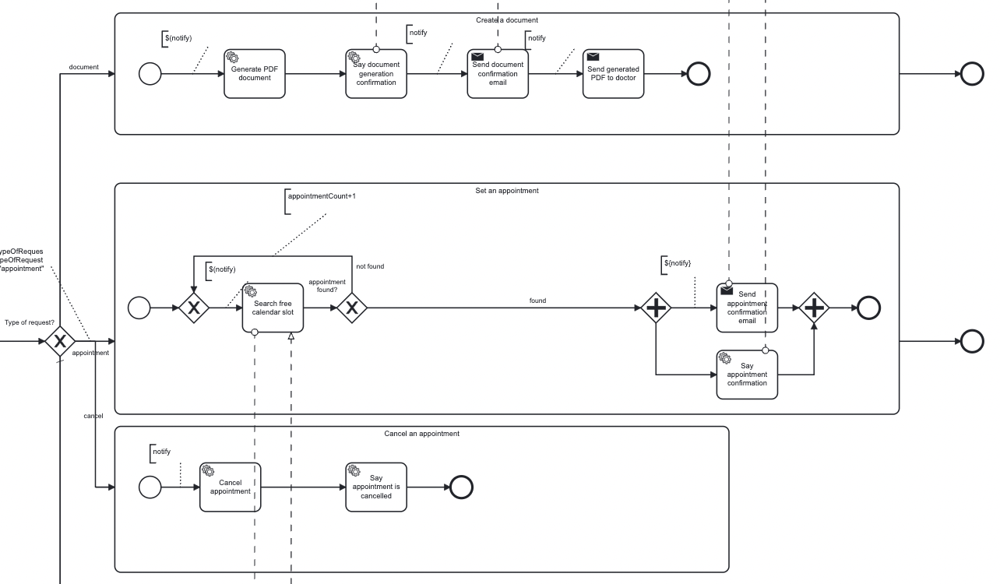

## Subprocess - "Set an appointment":
If the patient is requesting for a appointment the case "appointment" is selected and the subprocess "Set an appointment" will be started.

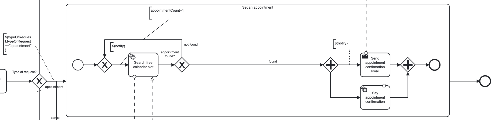

To iterate through all available appointments, a counter variable will be established and during a loop used to for the MAKE event search:

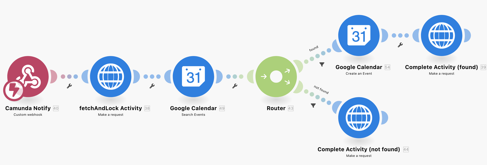

This MAKE scenario does a fetchAndLock, to get the variables from the BPMN (i.e. start date, duration, name and birthday of the patient). With that it starts a Google calendar event search to find the next free slot by using the iterated start date and time as well as the appointment duration in the doctorts appointment calendar:

This will go through all available calendar slots and finds the next most fitting one on [Google Calendar](https://calendar.google.com/calendar/u/0?cid=NTJmMTZlMzhiZTZiOTJjZTBhMDZmNGQ4ZTk0MjFmY2RiMGEwMmY2YTY3NjAxODI1NDE0YTRjOThlM2I2YWUxYkBncm91cC5jYWxlbmRhci5nb29nbGUuY29t):

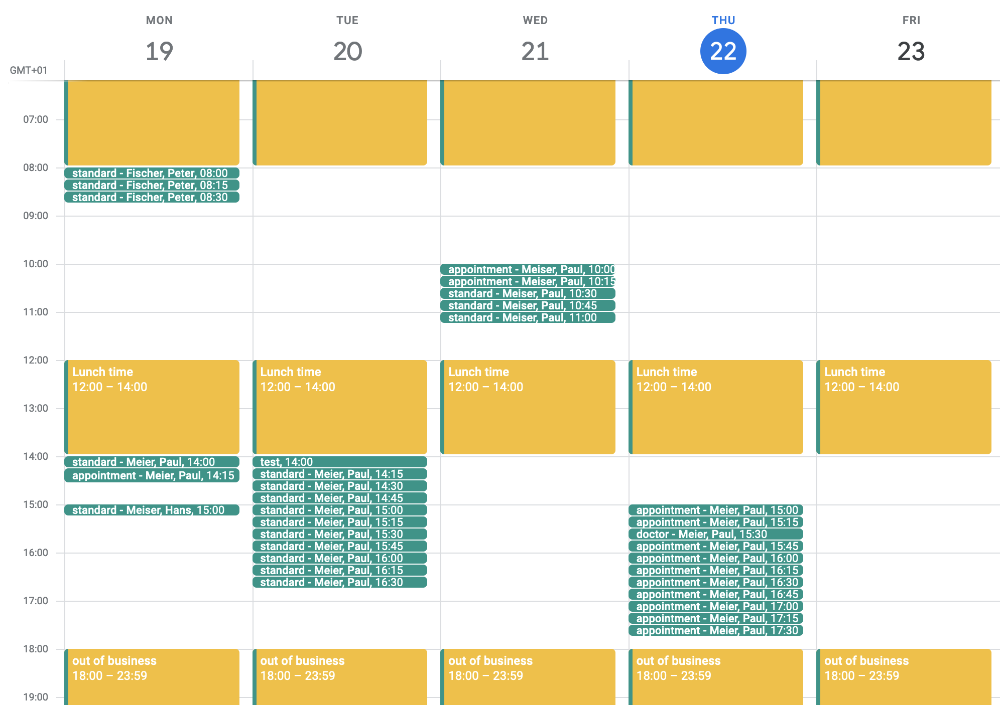

If there is no free slot the "appointmentFound" is set to "false" and the last appointmentCount will be increased by 1. This variable is used as a modifier in the MAKE Google calendar event search to change the starting time:

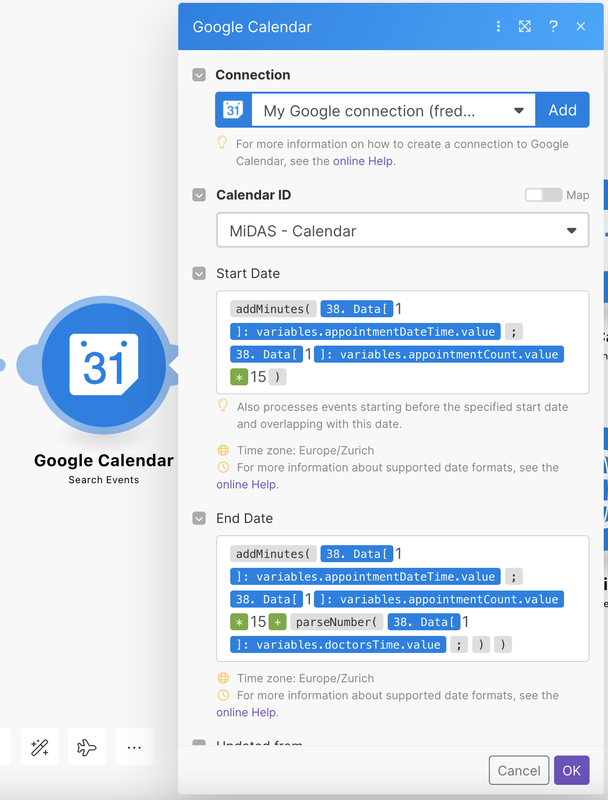

Depending of the DMS decicion table the Calendar search seeks for a free 15 minutes ("short"), 20 minutes ("standard") or 30 minutes ("checkup") consultation slot. If the slot is free, it will be reserved the variable "appointmentFound" is set to "true" and the "confirmedAppointmentDateTime" will be given back to the BPMN.

The system filters during MAKE-processing, if the desired appointment date/time is out of opening times and gives the patient the opening times as a feedback.

1. Check if date variable is before 12:00 else add 2 hours
```
{{if(parseDate(get(split(toString(2.appStart); space); 2); "HH:mm") >= parseDate("12:00"; "HH:mm") & parseDate(get(split(toString(2.appStart); space); 2); "HH:mm") < parseDate("14:00"; "HH:mm"); addHours(2.appStart; 2); 2.appStart)}}
```

2. Check if date variable is after 12:00 and before 14:00 else set time to 14:00 same day
```
{{if(parseDate(get(split(toString(2.appStart); space); 2); "HH:mm") >= parseDate("12:00"; "HH:mm") & parseDate(get(split(toString(2.appStart); space); 2); "HH:mm") < parseDate("14:00"; "HH:mm"); setHour(setMinute(setSecond(2.appStart; 0); 0); 14); 2.appStart)}}
```

3. Check if date variable is after 18:00 and set date +1 day and set time 8:00
```
{{if(parseDate(get(split(toString(2.appStart); space); 2); "HH:mm") >= parseDate("18:00"; "HH:mm"); addDays(setHour(setMinute(setSecond(2.appStart; 0); 0); 8); 1); 2.appStart)}}
```

4. Combine check #4 and #5 in one IF-Statement
```
{{if(parseDate(get(split(toString(2.appStart); space); 2); "HH:mm") >= parseDate("12:00"; "HH:mm") & parseDate(get(split(toString(2.appStart); space); 2); "HH:mm") < parseDate("14:00"; "HH:mm"); setHour(setMinute(setSecond(2.appStart; 0); 0); 14); if(parseDate(get(split(toString(2.appStart); space); 2); "HH:mm") >= parseDate("18:00"; "HH:mm"); addDays(setHour(setMinute(setSecond(2.appStart; 0); 0); 8); 1); 2.appStart))}}
```

5. Check if date is Friday after 18:00 and set new date +3 days at 8:00
```
{{if(parseDate(get(split(toString(2.appStart); space); 2); "HH:mm") >= parseDate("18:00"; "HH:mm") & toString(formatDate(2.appStart; "dddd")) = "Friday"; addDays(setHour(setMinute(setSecond(2.appStart; 0); 0); 8); 3); addDays(setHour(setMinute(setSecond(2.appStart; 0); 0); 8); 1))}}
```

6. Combine check #6 and #7 in one IF-statement
```
{{if(parseDate(get(split(toString(2.appStart); space); 2); "HH:mm") >= parseDate("12:00"; "HH:mm") & parseDate(get(split(toString(2.appStart); space); 2); "HH:mm") < parseDate("14:00"; "HH:mm"); setHour(setMinute(setSecond(2.appStart; 0); 0); 14); if((parseDate(get(split(toString(2.appStart); space); 2); "HH:mm") >= parseDate("18:00"; "HH:mm")); if(toString(formatDate(2.appStart; "dddd")) = "Friday"; addDays(setHour(setMinute(setSecond(2.appStart; 0); 0); 8); 3); addDays(setHour(setMinute(setSecond(2.appStart; 0); 0); 8); 1)); 2.appStart))}}
```

With the found appointment information a MAKE scenario is getting started ("MiDAS_sendAppointmentConfirmationEmail" to send a confirmation email to the patient with the appointment details.

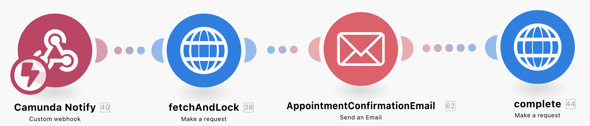

In parallel DialogFlow will get a fulfillmentText from the MAKE scenario:

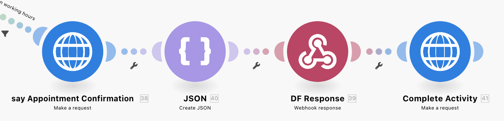

If both MAKE processes are finished and send the BPMN a "complete" message, the task will be set to complete.

## Subprocess - "Create a document":
If the type of request from the decision table is set to "document", the "Create a document" subprocess will be startet.

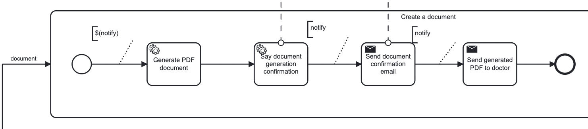

First will be started a notify request to a MAKE scenario, that starts a fetchAndLock in the BPMN, gets the variable data and creates a [Google Docs document](https://docs.google.com/document/d/1__BGRs0A5PFFPN2gSR_DahdDpYU-vr4PPi-uOlTCRb8/edit?usp=sharing) from a template, fills all the "{{variable_name}}" placeholder it with the patient data and is saving it as a PDF into a Google Drive temp folder.

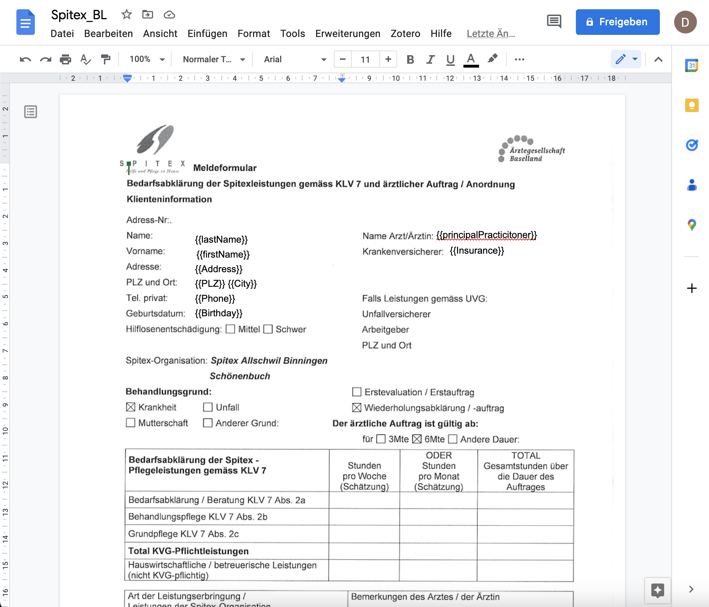

After that, the document ID will be send back into the BPMN enviroment.

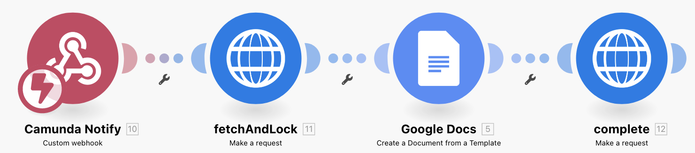

The BPMN will start another MAKE scenario to create a fulfillment Text message into DialogFlow for confirming the document request.

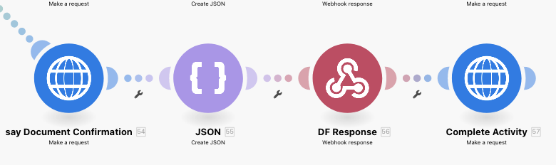

Next a webhook notify will be started to send the patient or person who is requesting the document the confirmation via email as well:

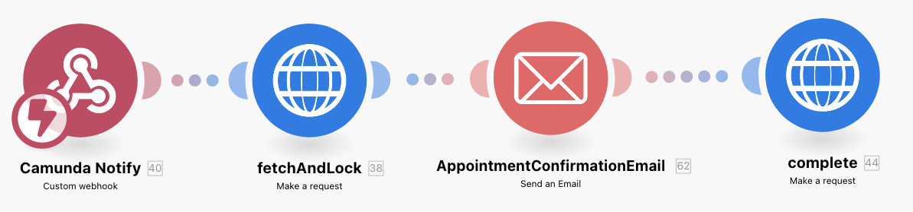

The following step will fetch the document ID from the BPMN, downloads the document from the temp folder, delete it in the temp folder and is attaching the PDF file to a prepared Email to the principal physician of the patient for digital signing and forwards the document to the desired destination address (i.e. "Spitex Anmeldezentrum" for Spitex referrals):

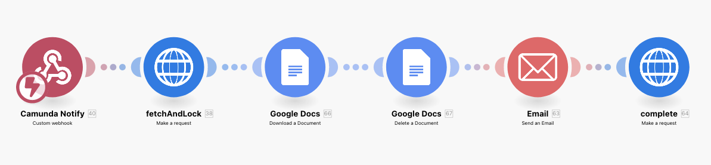

Example of a Spitex referral received by the principal physician:

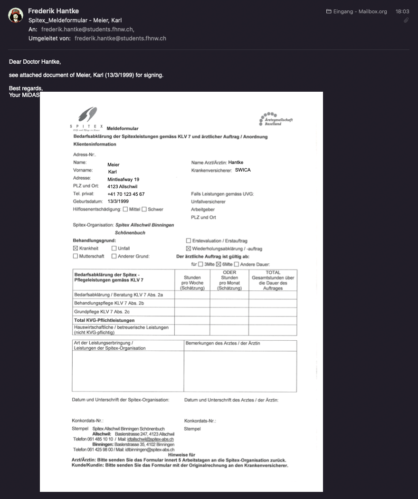

## Subprocess - "Cancel an appointment":

If the patient wanted to cancel an appointment, the patient has to be identified as "known", the request gets the "typeOfRequest" variable from the DMN and is starting the subprocess and desired MAKE scenario.

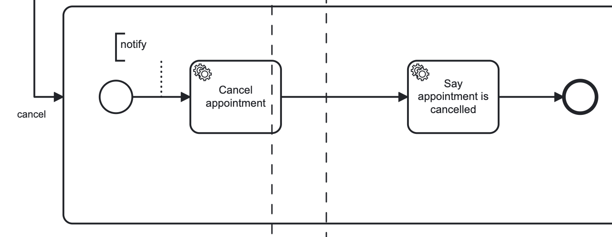

Here it searches for the appointment event by starting date, fist name and last name of the patient as well as the principal practitioner (gathered from DialogFlow). If it finds the event, MAKE will delete it and BPMN sends a fulfillmentText message  to DialogFlow. Otherwise DialogFlow will get a "not found" fulfillmentText message. The BPMN gets a HTTP-request answer, that the process has been finished and the task can be set to completed.

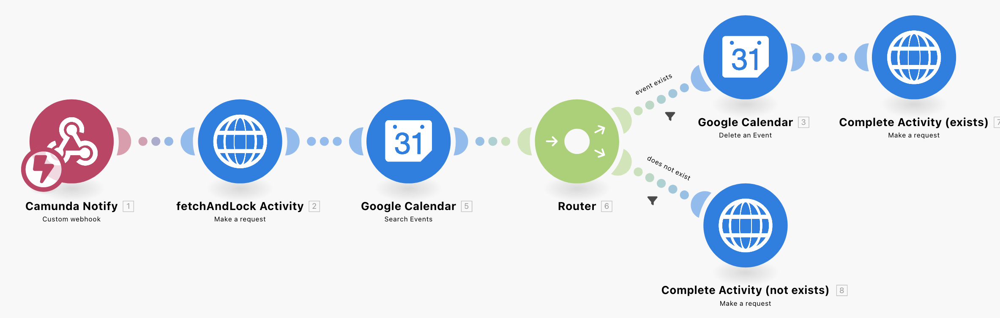

End of the BPMN main and subprocess.

# Example code used MAKE scripts and filters:
1. Parse time only as string: 
```
{{get(split(toString(2.appStart); space); 2)}}
```
2. Parse time only as new date
```
{{parseDate(get(split(toString(2.appStart); space); 2); "HH:mm")}}
```

3. Check if date variable is before 12:00 else add 2 hours
```
{{if(parseDate(get(split(toString(2.appStart); space); 2); "HH:mm") >= parseDate("12:00"; "HH:mm") & parseDate(get(split(toString(2.appStart); space); 2); "HH:mm") < parseDate("14:00"; "HH:mm"); addHours(2.appStart; 2); 2.appStart)}}
```

4. Check if date variable is after 12:00 and before 14:00 else set time to 14:00 same day
```
{{if(parseDate(get(split(toString(2.appStart); space); 2); "HH:mm") >= parseDate("12:00"; "HH:mm") & parseDate(get(split(toString(2.appStart); space); 2); "HH:mm") < parseDate("14:00"; "HH:mm"); setHour(setMinute(setSecond(2.appStart; 0); 0); 14); 2.appStart)}}
```

5. Check if date variable is after 18:00 and set date +1 day and set time 8:00
```
{{if(parseDate(get(split(toString(2.appStart); space); 2); "HH:mm") >= parseDate("18:00"; "HH:mm"); addDays(setHour(setMinute(setSecond(2.appStart; 0); 0); 8); 1); 2.appStart)}}
```

6. Combine check #4 and #5 in one IF-Statement
```
{{if(parseDate(get(split(toString(2.appStart); space); 2); "HH:mm") >= parseDate("12:00"; "HH:mm") & parseDate(get(split(toString(2.appStart); space); 2); "HH:mm") < parseDate("14:00"; "HH:mm"); setHour(setMinute(setSecond(2.appStart; 0); 0); 14); if(parseDate(get(split(toString(2.appStart); space); 2); "HH:mm") >= parseDate("18:00"; "HH:mm"); addDays(setHour(setMinute(setSecond(2.appStart; 0); 0); 8); 1); 2.appStart))}}
```

7. Check if date is Friday after 18:00 and set new date +3 days at 8:00
```
{{if(parseDate(get(split(toString(2.appStart); space); 2); "HH:mm") >= parseDate("18:00"; "HH:mm") & toString(formatDate(2.appStart; "dddd")) = "Friday"; addDays(setHour(setMinute(setSecond(2.appStart; 0); 0); 8); 3); addDays(setHour(setMinute(setSecond(2.appStart; 0); 0); 8); 1))}}
```

8. Combine check #6 and #7 in one IF-statement
```
{{if(parseDate(get(split(toString(2.appStart); space); 2); "HH:mm") >= parseDate("12:00"; "HH:mm") & parseDate(get(split(toString(2.appStart); space); 2); "HH:mm") < parseDate("14:00"; "HH:mm"); setHour(setMinute(setSecond(2.appStart; 0); 0); 14); if((parseDate(get(split(toString(2.appStart); space); 2); "HH:mm") >= parseDate("18:00"; "HH:mm")); if(toString(formatDate(2.appStart; "dddd")) = "Friday"; addDays(setHour(setMinute(setSecond(2.appStart; 0); 0); 8); 3); addDays(setHour(setMinute(setSecond(2.appStart; 0); 0); 8); 1)); 2.appStart))}}
```